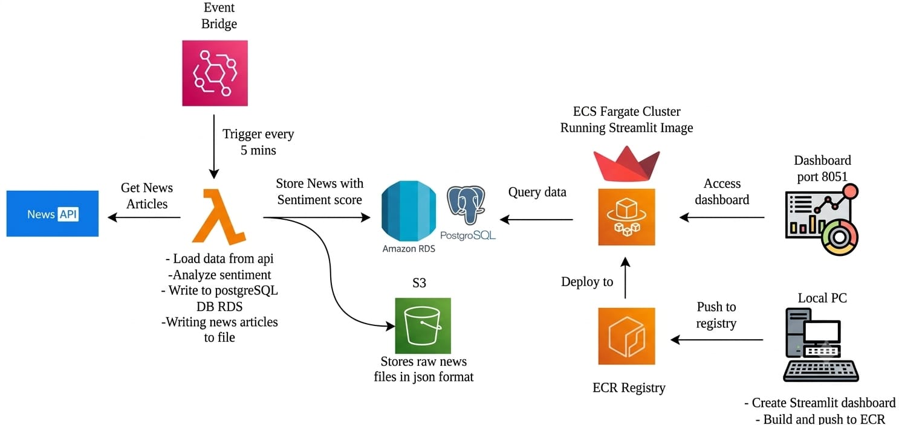

# 📰 Real-Time News Sentiment Analysis Pipeline using AWS

An end-to-end, event-driven news ingestion, sentiment analysis, storage, and visualization pipeline built with AWS, Python, Docker, PostgreSQL, and Streamlit.

---

# 📌 Project Overview

This project is an end-to-end real-time news sentiment analysis pipeline designed to demonstrate how modern cloud and data engineering technologies can be combined to build an automated data workflow.

The system periodically collects the latest technology-related news from the GNews API, stores the original API response in Amazon S3, processes the articles using Python, performs sentiment analysis using VADER, and stores the structured results in PostgreSQL hosted on Amazon RDS.

A Streamlit dashboard reads the processed data from PostgreSQL and presents sentiment statistics and news information through a web interface. The dashboard is containerized with Docker and deployed on Amazon ECS using AWS Fargate. Docker images are stored in Amazon ECR.

The entire ingestion workflow is automated using Amazon EventBridge Scheduler, which invokes the Lambda function every five minutes.

This project showcases:

- Event-driven architecture
- Serverless data processing
- REST API integration
- Sentiment analysis
- Cloud storage
- Relational database integration
- Docker containerization
- AWS container deployment
- Data visualization
- IAM and cloud monitoring

---

# 🏗️ Architecture Diagram

The architecture flow is shown below:



### Workflow Steps

1. Amazon EventBridge Scheduler triggers AWS Lambda every 5 minutes.
2. Lambda requests the latest technology news from the GNews API.
3. The raw GNews JSON response is stored in Amazon S3.
4. Lambda extracts and processes individual news articles.
5. VADER performs sentiment analysis on the article text.
6. Processed articles and sentiment results are stored in Amazon RDS PostgreSQL.
7. The Streamlit application queries PostgreSQL.
8. The Streamlit dashboard runs as a container on Amazon ECS Fargate.
9. Docker images are stored in Amazon ECR.
10. CloudWatch collects application and execution logs.

---

# ⚙️ Tech Stack

## ☁️ AWS Services Used

- Amazon EventBridge Scheduler
- AWS Lambda
- Amazon S3
- Amazon RDS PostgreSQL
- Amazon ECS
- AWS Fargate
- Amazon ECR
- AWS IAM
- Amazon CloudWatch

---

## 🗄️ Database & Storage

- PostgreSQL
- Amazon RDS
- Amazon S3

---

## 📰 News API

- GNews API
- REST API
- JSON

---

## 🤖 Sentiment Analysis

- VADER Sentiment Analysis
- vaderSentiment Python library

---

## 📊 Dashboard

- Streamlit

---

## 🐳 Containerization

- Docker
- Amazon ECR
- Amazon ECS Fargate

---

## 🧑‍💻 Programming Language

- Python 3.13

---

# 🔄 Complete Workflow

## Step 1 — Automated Trigger

Amazon EventBridge Scheduler triggers the Lambda function every five minutes.

EventBridge
    ↓
AWS Lambda

This removes the need to manually execute the ingestion process.

---

## Step 2 — Fetch News Data

The Lambda function connects to the GNews API and requests recent technology news.

The API returns a JSON response containing article information such as:

- Title
- Description
- Content
- URL
- Image
- Publication date
- Source information

Example flow:
```
GNews API
    ↓
JSON Response
    ↓
AWS Lambda
```
---

## Step 3 — Store Raw Data in S3

Before transforming the data, the original GNews API response is stored in Amazon S3.

Example structure:
```
news-sentiment-raw/
└── raw-news/
    └── 2026/
        └── 09/
            └── 08/
                └── 143000.json
```
Keeping the raw response provides a source copy that can be used for debugging, auditing, or future reprocessing.

---

## Step 4 — Process News Articles

Lambda extracts the articles from the API response.

The processing layer:

- Extracts article fields
- Combines title, description, and content
- Normalizes source information
- Prepares text for sentiment analysis
- Creates structured article records

The raw API data is transformed into a consistent format before database insertion.

---

## Step 5 — Sentiment Analysis

The processed article text is passed to VADER Sentiment Analysis.

VADER calculates a compound sentiment score.

The project classifies the result using:

Compound Score >= 0.05
        ↓
     Positive

Compound Score <= -0.05
        ↓
     Negative

Between -0.05 and 0.05
        ↓
     Neutral

Each article receives:

- Sentiment Label
- Sentiment Score

Example:
```
{
    "label": "positive",
    "score": 0.91
}
```
---

## Step 6 — Store Processed Data in PostgreSQL

The processed articles are inserted into PostgreSQL hosted on Amazon RDS.

The database stores structured information including:

- Article ID
- Title
- Description
- Content
- URL
- Image
- Publication timestamp
- Language
- Source
- Sentiment
- Sentiment score

Duplicate articles are prevented using the article ID.
```
Article
   ↓
Check Article ID
   ↓
Already Exists?
   ├── Yes → Skip
   └── No  → Insert
```
---

## Step 7 — Streamlit Dashboard

The Streamlit application connects to PostgreSQL and reads the processed data.

The dashboard provides a visual representation of the collected news and sentiment information.

Typical metrics include:

- Total Articles
- Positive Articles
- Neutral Articles
- Negative Articles

It can also display individual articles and their sentiment scores.

---

## Step 8 — Docker Containerization

The application workloads are packaged using Docker.

The project contains container configurations for:

- AWS Lambda
- Streamlit Dashboard

Containerization provides a reproducible environment containing the application and its dependencies.

---

## Step 9 — Amazon ECR

The Docker images are pushed to private Amazon ECR repositories.

Repositories:

news-sentiment-lambda
news-sentiment-dashboard

Deployment flow:

Docker Build
     ↓
Amazon ECR
     ↓
AWS Service

---

## Step 10 — ECS Fargate Deployment

The Streamlit dashboard runs as an ECS service using AWS Fargate.

Current configuration:

Cluster:
news-sentiment-cluster

Service:
news-sentiment-dashboard-service

Container Port:
8501

Fargate provides managed container compute without requiring the project to manage EC2 servers.

---

# 📂 Project Structure
```
news-sentiment-analysis/
│
├── dashboard/
│   ├── app.py
│   └── Dockerfile
│
├── src/
│   ├── __init__.py
│   │
│   ├── database/
│   │   ├── __init__.py
│   │   ├── connection.py
│   │   ├── tables.py
│   │   └── insert_news.py
│   │
│   ├── news/
│   │   ├── __init__.py
│   │   ├── gnews.py
│   │   └── processor.py
│   │
│   ├── sentiment/
│   │   ├── __init__.py
│   │   └── analyzer.py
│   │
│   ├── storage/
│   │   ├── __init__.py
│   │   └── s3.py
│   │
│   └── lambda_function.py
│
├── assets/
│   └── Architecture.png
│
├── Dockerfile
├── requirements.txt
├── .dockerignore
├── .gitignore
└── README.md
```
---

# 🧩 Component Responsibilities

## src/news/gnews.py

Responsible for communication with the GNews API.

Main responsibilities:

- Load the GNews API key
- Build the API request
- Request recent technology news
- Validate the response
- Return the JSON response
- Start the local ingestion workflow

---

## src/news/processor.py

Responsible for transforming raw articles into structured records.

It extracts information such as:

- Article ID
- Title
- Description
- Content
- URL
- Image
- Publication date
- Language
- Source information

It also invokes the sentiment analyzer.

---

## src/sentiment/analyzer.py

Contains the VADER sentiment analysis logic.

The function:

analyze_sentiment(text)

returns:
```
{
    "label": "positive",
    "score": 0.91
}
```
---

## src/storage/s3.py

Responsible for uploading raw GNews responses to Amazon S3.

The objects are stored using timestamp-based keys.

---

## src/database/connection.py

Creates PostgreSQL connections using environment variables.

Database credentials are not hard-coded into the application.

---

## src/database/tables.py

Contains database table creation logic.

---

## src/database/insert_news.py

Handles inserting processed articles into PostgreSQL.

The article ID is used to prevent duplicate records.

---

## src/lambda_function.py

Acts as the AWS Lambda entry point and coordinates the complete workflow:
```
Fetch News
    ↓
Upload Raw Data
    ↓
Process Articles
    ↓
Analyze Sentiment
    ↓
Insert into PostgreSQL
    ↓
Return Result
```
---

## dashboard/app.py

Contains the Streamlit dashboard that reads the processed data from PostgreSQL and presents the results visually.

---

# 🗄️ Database Schema

The PostgreSQL database stores processed news articles.

A typical record contains:
```
Field                 Purpose
--------------------  --------------------------------
id                    Unique article identifier
title                 Article title
description           Article summary
content               Article content
url                   Original article URL
image                 Article image
published_at          Publication timestamp
language              Article language
source_name           News source
source_url             Source URL
source_country        Source country
sentiment             Sentiment classification
sentiment_score       VADER compound score
```
---

# 🪣 Amazon S3 Data Storage

Amazon S3 is used as the raw data layer.

Instead of storing only transformed records, the pipeline preserves the original API response.

Example:
```
s3://news-sentiment-raw/
```
```
raw-news/
├── 2026/
│   └── 09/
│       └── 08/
│           ├── 101500.json
│           ├── 102000.json
│           └── 102500.json
```
Keeping raw data provides:

- Data backup
- Reprocessing capability
- Historical reference
- Debugging support
- Separation between raw and processed layers

---

# 🤖 Sentiment Processing

The pipeline combines available textual fields before analysis:
```
Title
   +
Description
   +
Content
   ↓
Combined Text
   ↓
VADER
   ↓
Compound Score
   ↓
Sentiment Label

Classification:

Score >= 0.05
      ↓
  POSITIVE

Score <= -0.05
      ↓
  NEGATIVE

-0.05 < Score < 0.05
      ↓
  NEUTRAL
```
---

# ⏱️ Event-Driven Automation

The ingestion process is automated using Amazon EventBridge Scheduler.

Current schedule:

Every 5 minutes

The scheduler invokes:

news-sentiment-lambda-container

This means the pipeline can continuously collect new data without manually executing the Python program.

---

# 🐳 Docker Architecture

Docker is used to package the application and its dependencies.

## Lambda Container

The Lambda image contains:

Python Runtime
    +
Python Dependencies
    +
src/
    +
Lambda Handler

The Lambda image is pushed to:
```
Amazon ECR
    ↓
Lambda Container Image
```
---

## Streamlit Container

The dashboard image contains:

Python Runtime
    +
Streamlit
    +
Database Dependencies
    +
dashboard/
    +
src/

Deployment flow:
```
Docker Build
     ↓
Amazon ECR
     ↓
ECS Task Definition
     ↓
ECS Service
     ↓
AWS Fargate
     ↓
Streamlit Dashboard
```
---

# 📦 Amazon ECR

Two private ECR repositories are used:

- news-sentiment-lambda
- news-sentiment-dashboard

ECR provides a centralized registry for the container images used by the AWS workloads.

---

# 🚀 ECS Fargate Deployment

The Streamlit dashboard runs as an ECS service using AWS Fargate.

Configuration:

Cluster:
news-sentiment-cluster

Service:
news-sentiment-dashboard-service

Fargate:
Linux x86_64

Container Port:
8501

Fargate allows the dashboard container to run without managing EC2 servers.

---

# 🔐 IAM & Security

AWS IAM controls access between the different components.

The Lambda execution role provides the permissions required for the workload.

The project uses permissions for:

- Lambda execution
- S3 object writing
- ECR image access
- ECS task execution
- CloudWatch logging
- EventBridge invocation

## Credentials

Sensitive configuration is provided through environment variables.

Local development uses:

.env

The .env file must never be committed to GitHub.

Example:
```
GNEWS_API_KEY=your_api_key
DB_HOST=your_database_host
DB_PORT=5432
DB_NAME=news_sentiment
DB_USER=postgres
DB_PASSWORD=your_password
```
---

# 📊 Monitoring & Logging

Amazon CloudWatch is used to monitor the AWS workloads.

Lambda logs include information such as:
```
Found 10 raw articles.
Processed 10 articles.
Inserted 10 articles into PostgreSQL.
```
CloudWatch is useful for:

- Debugging Lambda failures
- Checking EventBridge-triggered executions
- Monitoring application behavior
- Investigating database/API errors
- Reviewing ECS application logs

---

# 🚀 Features
```
✅ Automated technology news ingestion
✅ Event-driven serverless architecture
✅ EventBridge scheduling every 5 minutes
✅ GNews REST API integration
✅ Raw JSON archival in Amazon S3
✅ VADER sentiment analysis
✅ Positive / Neutral / Negative classification
✅ Sentiment score storage
✅ PostgreSQL database on Amazon RDS
✅ Duplicate article protection
✅ Docker containerization
✅ Amazon ECR image storage
✅ ECS Fargate deployment
✅ Streamlit analytics dashboard
✅ CloudWatch logging
✅ IAM-based access control
✅ End-to-end AWS integration
```
---

# 🧪 Sample Use Cases

This project can be used for:

- Real-time news monitoring
- Technology news analytics
- Sentiment analysis demonstrations
- NLP learning projects
- AWS serverless architecture practice
- Cloud data engineering portfolios
- PostgreSQL and RDS practice
- Docker container deployment practice
- ECS Fargate learning
- Streamlit dashboard development
- Event-driven architecture demonstrations

---

# 🛠️ Setup Instructions

## 1️⃣ Clone Repository
```
git clone https://github.com/your-username/news-sentiment-analysis.git
```
```
cd news-sentiment-analysis
```
---

## 2️⃣ Create Virtual Environment

### Windows
```
python -m venv venv
venv\Scripts\activate
```
### Linux / macOS
```
python3 -m venv venv
source venv/bin/activate
```
---

## 3️⃣ Install Dependencies
```
pip install -r requirements.txt
```
---

## 4️⃣ Configure Environment Variables

Create .env in the project root:
```
GNEWS_API_KEY=your_gnews_api_key

DB_HOST=your_rds_endpoint
DB_PORT=5432
DB_NAME=news_sentiment
DB_USER=postgres
DB_PASSWORD=your_database_password
```
Do not commit this file.

---

## 5️⃣ Configure AWS

Configure the AWS CLI:
```
aws configure
```
Set the AWS region to:
```
ap-south-1
```
Verify the configuration:
```
aws sts get-caller-identity
```
---

## 6️⃣ Configure AWS Services

Create and configure:

- Amazon S3 bucket
- Amazon RDS PostgreSQL database
- ECR repositories
- Lambda function
- EventBridge Scheduler
- ECS cluster
- ECS service
- IAM roles
- CloudWatch log groups

---

# ▶️ Run the Pipeline Locally

Run:
```
python -m src.news.gnews
```
Expected workflow:
```
GNews API
    ↓
Raw JSON
    ↓
S3 Upload
    ↓
Article Processing
    ↓
VADER Sentiment
    ↓
PostgreSQL

Example output:

Found 10 raw articles.
Processed 10 articles.
Inserted 10 articles into PostgreSQL.
```
---

# 📊 Run Streamlit Locally

Start the dashboard:
```
streamlit run dashboard/app.py
```
The dashboard will run on:
```
http://localhost:8501
```
---

# 🐳 Run Dashboard with Docker

Build the image:
```
docker build -f dashboard/Dockerfile -t news-sentiment-dashboard:latest .
```
Run:
```
docker run --env-file .env -p 8501:8501 news-sentiment-dashboard:latest
```
Open:
```
http://localhost:8501
```
---

# 🐳 Build Lambda Container Image

Build:
```
docker build --provenance=false -t news-sentiment-lambda:latest .
```
The --provenance=false option is used for compatibility with the Lambda container image deployment used in this project.

---

# ☁️ AWS Deployment

## AWS Region

The current deployment uses:
```
ap-south-1
```
AWS Mumbai Region.

---

## 1️⃣ Create S3 Bucket

Create the raw-data bucket:
```
news-sentiment-raw
```
Lambda uploads raw GNews JSON responses into this bucket.

---

## 2️⃣ Create RDS PostgreSQL

Create an Amazon RDS PostgreSQL database.

Database name:
```
news_sentiment
```
The database stores processed news and sentiment results.

---

## 3️⃣ Create ECR Repositories

Create:
```
news-sentiment-lambda
news-sentiment-dashboard
```
---

## 4️⃣ Authenticate Docker with ECR
```
aws ecr get-login-password --region ap-south-1 | docker login --username AWS --password-stdin YOUR_ACCOUNT_ID.dkr.ecr.ap-south-1.amazonaws.com
```
---

## 5️⃣ Push Lambda Image
```
docker tag news-sentiment-lambda:latest YOUR_ACCOUNT_ID.dkr.ecr.ap-south-1.amazonaws.com/news-sentiment-lambda:latest
```
```
docker push YOUR_ACCOUNT_ID.dkr.ecr.ap-south-1.amazonaws.com/news-sentiment-lambda:latest
```
---

## 6️⃣ Push Dashboard Image
```
docker tag news-sentiment-dashboard:latest YOUR_ACCOUNT_ID.dkr.ecr.ap-south-1.amazonaws.com/news-sentiment-dashboard:latest
```
```
docker push YOUR_ACCOUNT_ID.dkr.ecr.ap-south-1.amazonaws.com/news-sentiment-dashboard:latest
```
---

## 7️⃣ Deploy Lambda

Deploy the Lambda function using the ECR container image.

Configure environment variables:
```
GNEWS_API_KEY
DB_HOST
DB_PORT
DB_NAME
DB_USER
DB_PASSWORD
```
Configure the Lambda execution role with the required permissions.

---

## 8️⃣ Configure EventBridge

Create an EventBridge Scheduler:
```
Name:
news-sentiment-every-5-min

Schedule:
rate(5 minutes)

Target:
news-sentiment-lambda-container
```
---

## 9️⃣ Deploy Streamlit to ECS Fargate

Create:
```
ECS Cluster
    ↓
Task Definition
    ↓
ECS Service
    ↓
Fargate Task
```
Configure the dashboard container:
```
Port: 8501
Protocol: TCP
```
The ECS service keeps the Streamlit dashboard running.

---

# 🔗 Pipeline Components at a Glance
```
Component              Technology                 Responsibility
---------------------  -------------------------  -------------------------------
Scheduler              EventBridge                Trigger pipeline
Ingestion              Lambda                     Execute pipeline
Source                 GNews API                  Provide news
Raw Storage            S3                         Store original JSON
Processing             Python                     Transform articles
NLP                    VADER                     Analyze sentiment
Database               RDS PostgreSQL             Store processed data
Container Registry     ECR                        Store Docker images
Dashboard              Streamlit                  Visualize results
Container Platform     ECS Fargate                Run dashboard
Monitoring             CloudWatch                 Logs and troubleshooting
Access Control         IAM                        AWS permissions
```
---

# 🧪 Testing Strategy

The system can be tested at multiple levels.
```
## Local Pipeline Test

GNews API
    ↓
S3
    ↓
Processing
    ↓
Sentiment
    ↓
PostgreSQL

Run:

python -m src.news.gnews

---

## Dashboard Test

Run:

streamlit run dashboard/app.py

Verify that:

- Database connection works
- Articles appear
- Sentiment counts are displayed
- New database records are reflected

---

## AWS Test

Verify:

- EventBridge triggers Lambda
- Lambda successfully calls GNews
- S3 objects are created
- PostgreSQL receives records
- ECS task remains healthy
- Streamlit dashboard is accessible
- CloudWatch logs show successful executions

---
```
# 📊 Example Output

A successful Lambda invocation returns:
```
{
  "statusCode": 200,
  "message": "Processed and inserted 10 articles."
}
```
Example logs:
```
Found 10 raw articles.
Processed 10 articles.
Inserted 10 articles into PostgreSQL.

Example dashboard metrics:

Total Articles     : 48
Positive Articles  : 35
Neutral Articles   : 3
Negative Articles  : 10

These values are generated from the PostgreSQL data and change as new articles are processed.
```


# 🔮 Future Improvements

## Security

- Move database credentials to AWS Secrets Manager
- Place RDS in private subnets
- Configure Lambda VPC networking
- Restrict security-group access
- Add HTTPS using an Application Load Balancer
- Add dashboard authentication

## NLP

- Use transformer-based sentiment models
- Add emotion detection
- Add topic classification
- Add keyword extraction
- Add named entity recognition
- Add automatic article summarization

## Dashboard

- Historical sentiment trends
- Interactive charts
- Source filtering
- Date filtering
- Keyword search
- Sentiment score distribution
- Article category filtering

## Data Engineering

- Add message queues
- Add retry and dead-letter handling
- Add data validation
- Add historical data partitioning
- Add data-quality monitoring
- Add more news categories

## DevOps

- GitHub Actions CI/CD
- Automated Docker builds
- Automated ECR deployments
- Automated tests
- Infrastructure as Code using Terraform or AWS CDK

---

# 📚 Learning Outcomes

This project provides practical experience with:

### AWS

- AWS Lambda
- Amazon EventBridge
- Amazon S3
- Amazon RDS
- Amazon ECS
- AWS Fargate
- Amazon ECR
- AWS IAM
- Amazon CloudWatch

### Data Engineering

- REST API ingestion
- JSON processing
- Data transformation
- Raw and processed data layers
- Relational database storage
- Event-driven architecture
- Automated pipelines

### Python

- REST API integration
- JSON handling
- Modular application design
- Environment configuration
- PostgreSQL connectivity
- AWS SDK integration

### DevOps

- Docker
- Container images
- Amazon ECR
- ECS Fargate
- CloudWatch
- Git branches
- Pull requests

### NLP

- Text processing
- Sentiment classification
- VADER
- Compound sentiment scoring

---

---

# 🎓 Conclusion

This project demonstrates a complete cloud-based news analytics workflow from data ingestion to visualization.

The final architecture combines serverless computing, cloud storage, relational databases, NLP, containers, and automated scheduling:
```
EventBridge
    ↓
AWS Lambda
    ↓
GNews API
    ↓
Python Processing + VADER NLP
    ↓
Amazon S3 + Amazon RDS PostgreSQL
    ↓
Streamlit Dashboard
    ↓
ECS Fargate
```
The result is an automated, cloud-based system that demonstrates practical knowledge of AWS, Python, data engineering, NLP, PostgreSQL, Docker, container deployment, and dashboard development.

---


# 📄 License

This project is intended for educational, portfolio, and demonstration purposes.
